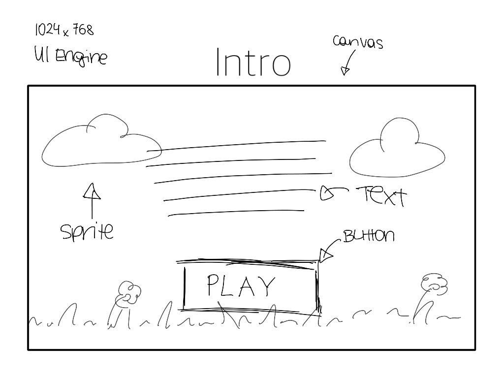
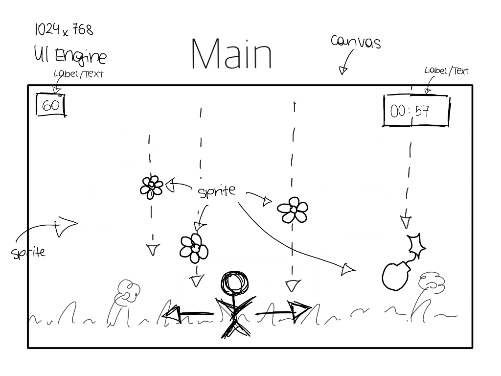
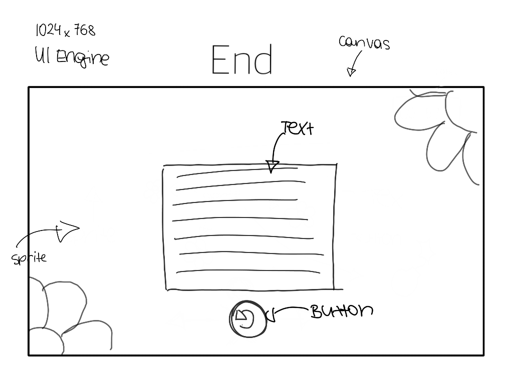

# MiniGame1-kkoenig

FlowerPower 2D Game

Collect as many flowers as possible but be careful, there are bombs too! Are you going to save nature or will you support the dreadful destructive inventions of humans?

**Progress:** 30%

### Development Platform
- OS: Windows 10
- Unity Version: 2018.2.14f1
- Visual Studio Version: 2017 15.9.4
- Scripting Runtime: .NET 35 Equivalent
- API Compatility: .NET 2.0 Subset

### Target Platform
WebGL

### Concept
- Idea: You have 60 seconds to collect with your character as many flowers as you can. With collecting them, your score will raise. If you touch one of the bombs you will loose points. At the end the score shows you your points.  
- Scenes scribbles: 

  

  

  

### Control
Move the character with the arrow keys. 

###Lessons learned:
- Setup of a simple game
- RandomGenerator
- Player Movement (x-Axis)
- SceneLoader

### 

Copyright by Kathrin König, 2019

